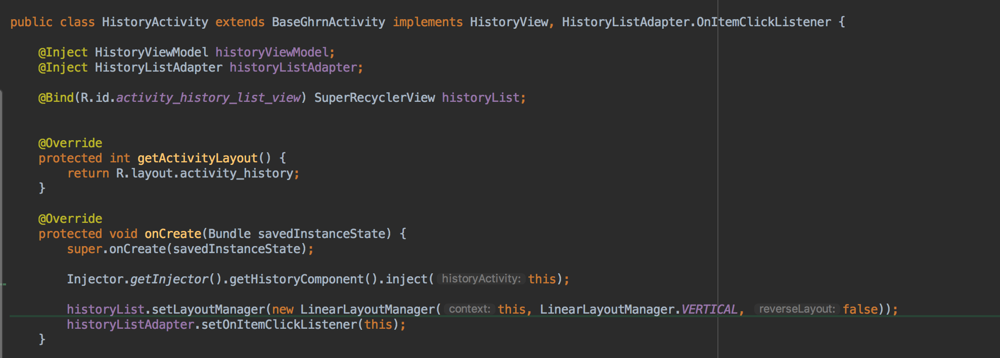
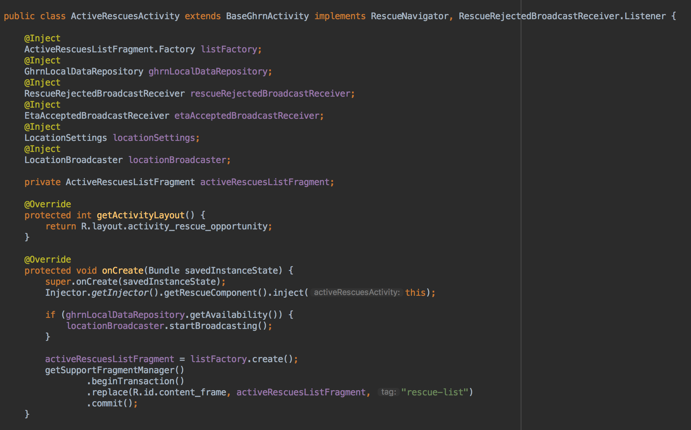
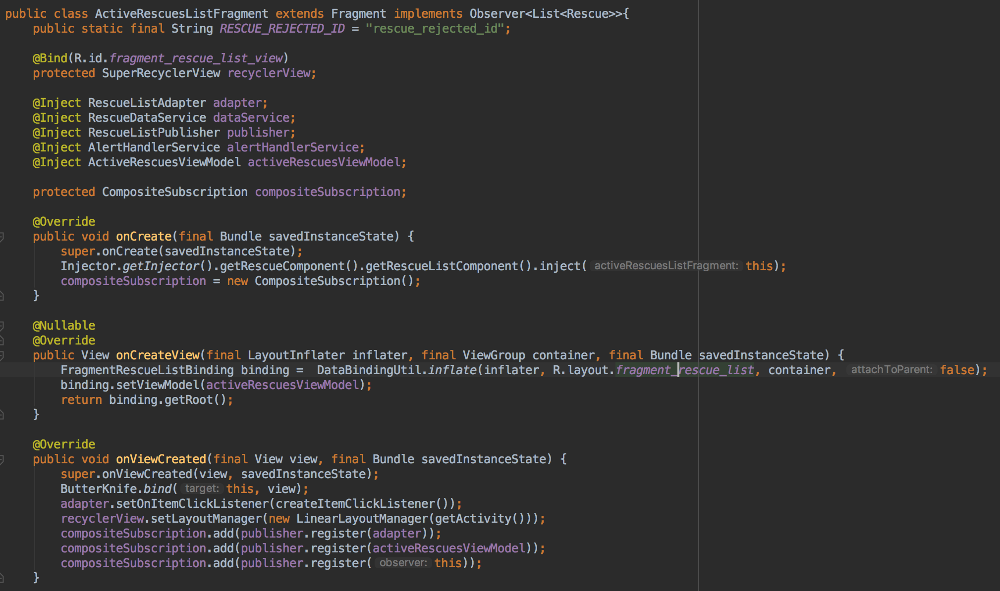
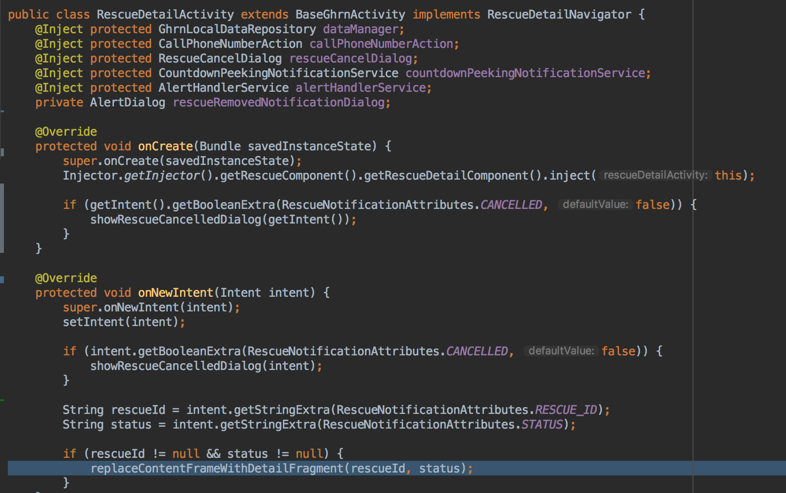
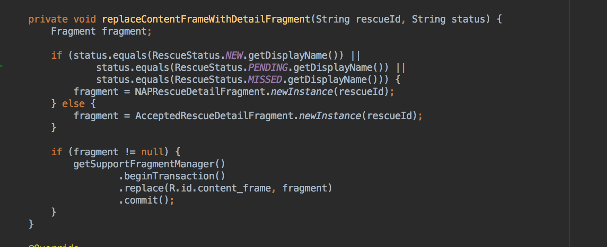

---

# Android View Refactor

---

## Disclaimer: 

There is no single perfect solution to how you build your views. Sorry.

---

## Goals of the refactor:

* Consistency
* Simplicity
* Testability
* Bonus: AppCompat

---
## State of views as of 12/7

---
### History
* Simple Layout
* No databinding
* Everything in Activity

---
### Active Rescue List
* Uses a fragment
* Uses databinding in Fragment
* Still has some behavior it is responsible for

---
### Active Rescue List Fragment
 
---

### Rescue Detail
* One Activity 
* Two Fragments

---
### How Rescue Detail Fragments are born

---
### Sidebar: "Nested doll" view
- BaseGhrnActivity
  - activity_content(FrameLayout) 
    - ~~content_frame(FrameLayout)~~
      - fragment_rescue_detail(Actual View)
- BaseGhrnActivity
  - activity_content(FrameLayout) 
    - fragment_rescue_detail(Actual View)*

###### `*` We might be able to clean up even more 
---

## Single Fragment Activities

---
## Possible Future Improvements
* Butterknife. Do we need it? Where do we need it?
* BaseGhrnActivity does *a lot*
