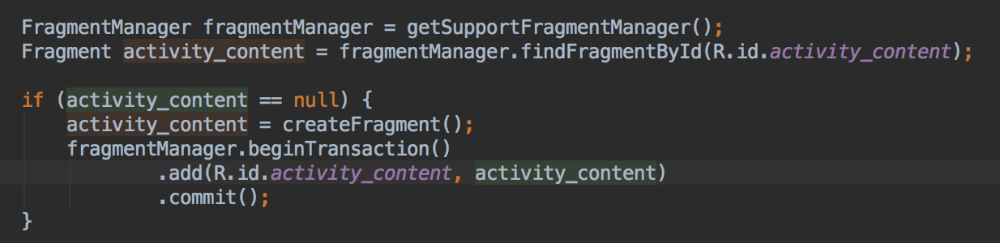
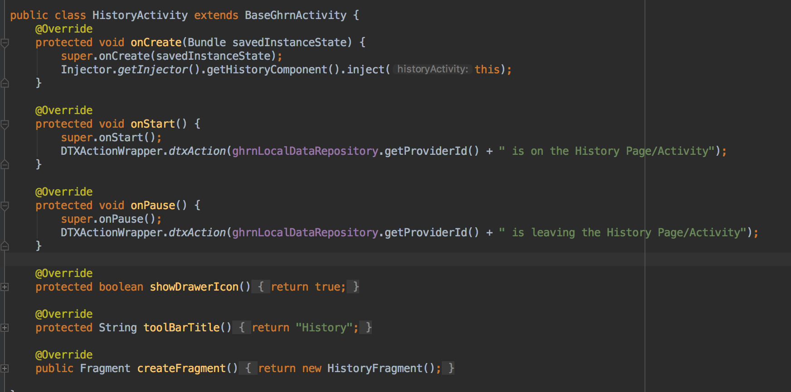
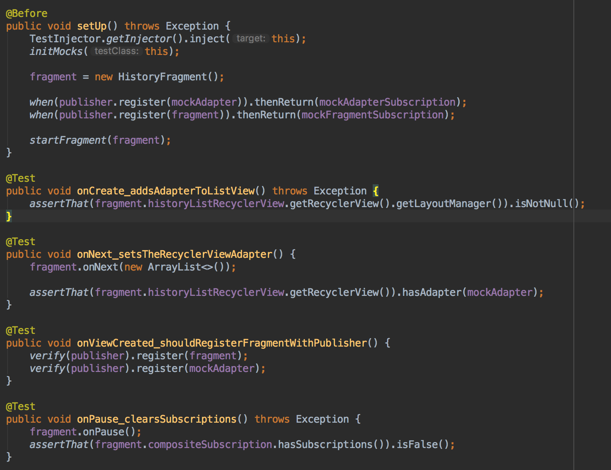
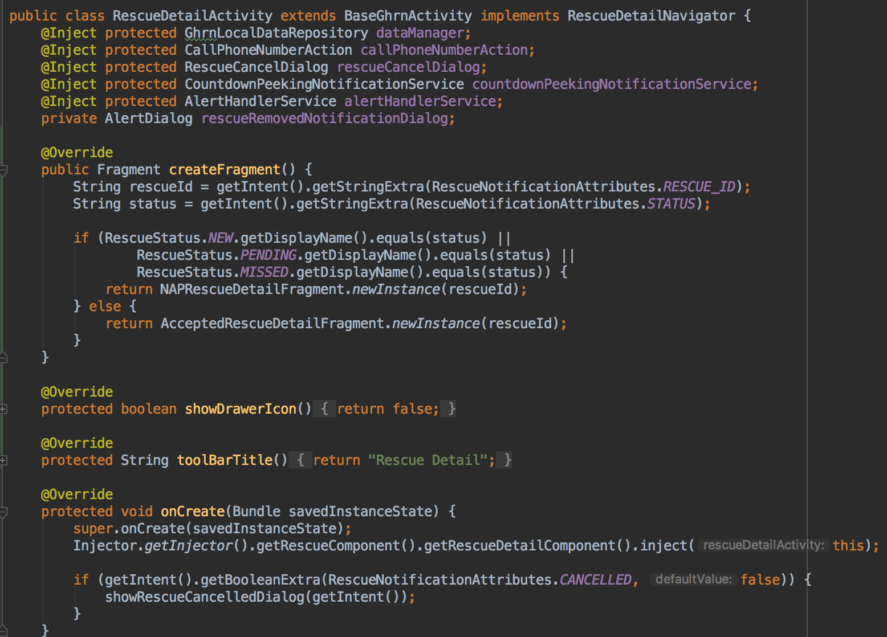

---

# Android View Refactor

---

## Disclaimer: 

There is no single perfect solution to how you build your views. Sorry.

---

## Goals of the refactor:

* Consistency
* Simplicity
* Testability
* Bonus: AppCompat

---
## State of views as of 12/7

---
### BaseGhrnActivity

###### Take note of how we are adding views

---
### History
* Simple Layout
* No databinding
* Everything in Activity

---
### Active Rescue List
* Uses a fragment
* Uses databinding in Fragment
* Still has some behavior it is responsible for

---
### Active Rescue List Fragment
 
---

### Rescue Detail
* One Activity 
* Two Fragments

---
### How Rescue Detail Fragments are born

---
### Sidebar: "Nested doll" view
- BaseGhrnActivity
  - activity_content(FrameLayout) 
    - ~~content_frame(FrameLayout)~~
      - fragment_rescue_detail(Actual View) - how much further does it go?
---
# Where did we end up?
---

### Single Fragment Activities
  * All views are added to BaseGhrnActivity once
  * Gain the reusability of Fragments
  * More hooks into lifecycle views
  * Fragment Manager
  * More flexibility with different devices

---
## State of views as of 12/10
---
### BaseGhrnActivity
###### Say hello to the Fragment Manager

---
### Fragment Manager
* ID's a UI fragment by the resource ID of it's container view
* When activity is created, a new transaction adds a fragments to it's list
* when activity is destroyed, all fragments are retrieved from the manager
* Backstack Management

---
### History

---

### History Fragment Test

---

### Rescue Detail
###### Minor changes

---

### Possible Future Improvements
* Butterknife. Do we need it? Where do we need it?
* BaseGhrnActivity does *a lot*
